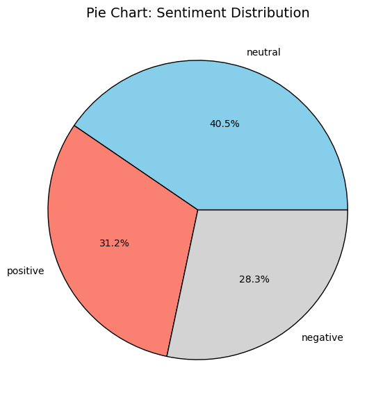
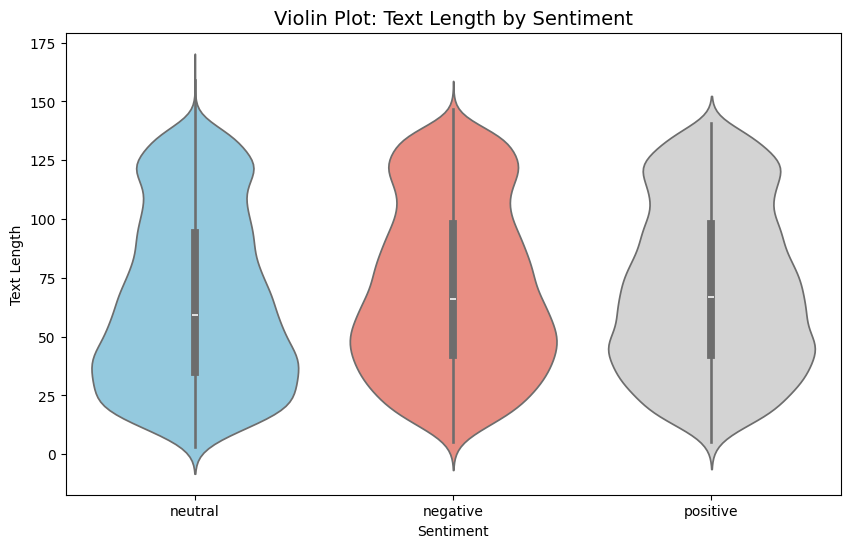
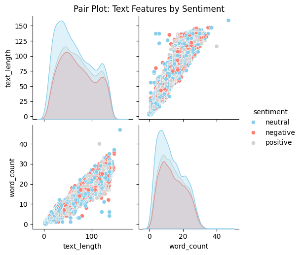
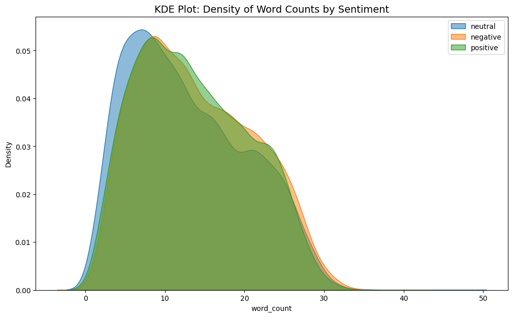
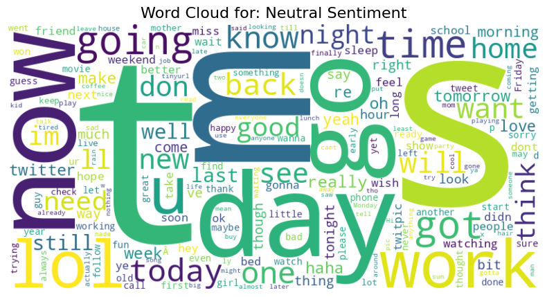
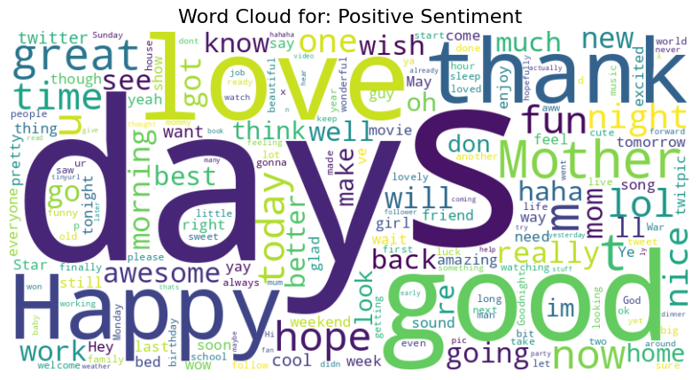
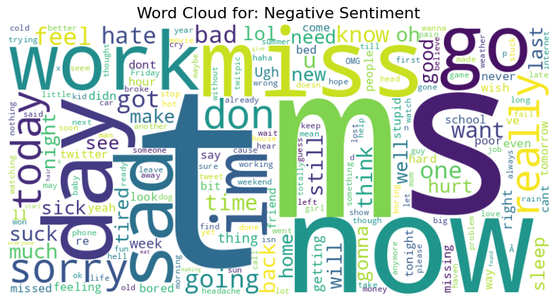
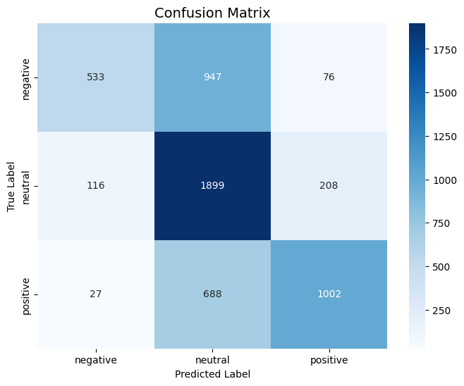
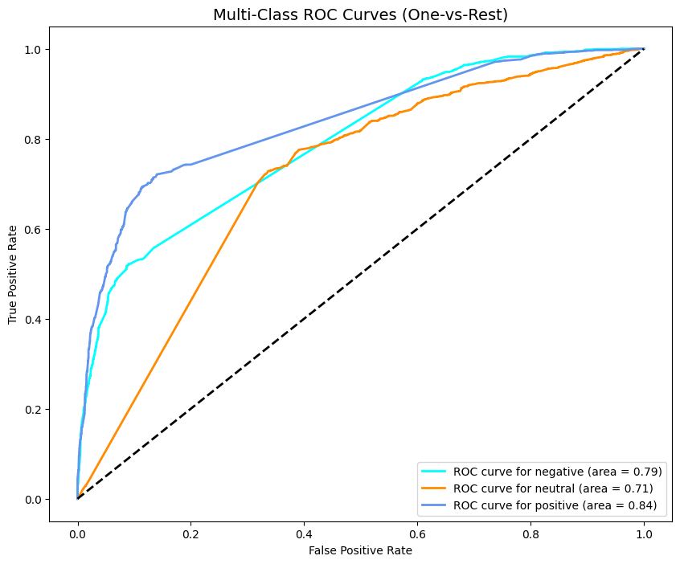

# Sentiment Analysis using AdaBoostClassifier

## Overview
This project implements a multi-class sentiment analysis pipeline using the AdaBoostClassifier on social media text data. The model classifies text into three categories: positive, negative, and neutral. It handles noisy, imbalanced data through comprehensive preprocessing, TF-IDF feature engineering, stratified train-test splitting, and hyperparameter tuning with GridSearchCV. The dataset consists of 27,481 samples from Kaggle, with class distribution: positive (31.3%), negative (28.3%), neutral (40.5%). Key achievements include an accuracy of 0.6248, macro F1-score of 0.6015, and ROC-AUC of 0.7819. Neutral class recall is high (0.85), while negative recall is lower (0.34) due to imbalance, validating AdaBoost's effectiveness for high-dimensional sparse text.

Sentiment analysis is essential for business analytics, politics, and social media monitoring, especially with over 500 million daily tweets. Challenges like slang, typos, and class imbalance are addressed via iterative boosting, which weights misclassified samples and minimizes exponential loss using weak learners (Decision Trees).

## Requirements
- **Python Version**: 3.8 or higher.
- **Libraries**:
  - `pandas`: Data manipulation.
  - `numpy`: Numerical computations.
  - `matplotlib` & `seaborn`: Visualizations.
  - `wordcloud`: Word cloud generation.
  - `nltk`: Preprocessing (stopwords, lemmatization).
  - `scikit-learn`: Modeling, metrics, and tuning.
  - `ipython`: Display utilities (for Jupyter/Colab).
- **Installation**:
  ```bash
  pip install pandas numpy matplotlib seaborn wordcloud nltk scikit-learn ipython
  ```
- **NLTK Data**: Automatically downloaded (stopwords, wordnet).
- **Environment**: Tested in Jupyter Notebook or Google Colab. No additional hardware required; runs on CPU with ~4GB RAM.

## Setup
1. Clone the repository.
2. Download the dataset: [Kaggle Sentiment Analysis Dataset](https://www.kaggle.com/datasets/abhi8923shriv/sentiment-analysis-dataset) (train.csv only).
3. Place `train.csv` in the `/content/` directory (for Colab) or update the file path in `code.ipynb`.
4. Run `code.ipynb` cell-by-cell in Jupyter/Colab.

## Usage
Execute the notebook sequentially:
- **Sections 1-2**: Import libraries and load data (displays head and info).
- **Section 3**: EDA – Adds text_length and word_count features; outputs descriptive stats.
- **Section 4**: Generates 8 visualizations (5 EDA types + confusion matrix + ROC curves). PNG files saved locally.
- **Section 5**: Preprocessing – Cleans text (removes URLs, mentions, hashtags, punctuation; applies lemmatization and stopword removal).
- **Section 6**: TF-IDF vectorization (10k features, bigrams) and stratified 80/20 split.
- **Section 7**: Trains AdaBoost via Pipeline and GridSearchCV (cv=3, parallel n_jobs=-1; ~10-20 min runtime).
- **Section 8**: Evaluates model with metrics, classification report, and plots.

Example output shapes: Train (21,985 x 10,000), Test (5,496 x 10,000).

## Methodology
### Data Cleaning and EDA
- Drop nulls in 'text' and 'sentiment'.
- Engineer features: `text_length` (character count), `word_count` (word tokens via regex `\w+`).
- Insights: Mean text length ~68 chars, word count ~13.4; distributions reveal neutral dominance and length variations.

### Visualizations
Advanced plots for insights:
- Pie chart for sentiment distribution.
- Violin plot for text length by sentiment.
- Pair plot for feature correlations (text_length vs. word_count, hue=sentiment).
- KDE plot for word count density by sentiment.
- Word clouds per class (filtered stopwords, no collocations).









**Word Clouds:**







### Preprocessing
Custom function `preprocess_text`:
- Convert to string.
- Regex removal: URLs (`http\S+|www\S+|https\S+`), mentions (`@\w+`), hashtags (`#`), non-alphabetic chars (`[^A-Za-z\s]`).
- Lowercase, tokenize, filter stopwords (NLTK English) and short words (<3 chars).
- Lemmatize with WordNetLemmatizer.
Efficiency: Vectorized `apply()`; preserves meaning better than stemming (per modern NLP practices).

**Sample:**
- **Original:** "I love this! @user #happy https://link"
- **Cleaned:** "love"

### Feature Engineering and Splitting
- TF-IDF: `max_features=10000` (caps dimensionality for efficiency, avoids OOM/redundancy), `ngram_range=(1,2)` (captures phrases like "not good").
- Label encoding: {'negative':0, 'neutral':1, 'positive':2}.
- Stratified split (random_state=42): Preserves class ratios (~80/20).

### Model Training
- Base: DecisionTreeClassifier (shallow, max_depth=1-3 to balance bias/variance).
- Ensemble: AdaBoostClassifier (iterative weak learner boosting; stable for sparse text).
- Pipeline: Enables nested tuning of `estimator__max_depth`.
- GridSearchCV: Params – `n_estimators=[50,100,200]`, `learning_rate=[0.1,0.5,1.0]`, `estimator__max_depth=[1,2,3]`. Scoring='accuracy', cv=3, n_jobs=-1 (parallel for speed).
- Optimal: n_estimators=200, learning_rate=1.0, max_depth=3 (deeper trees capture text complexity without overfitting).
Rationale: AdaBoost adapts to noise/outliers; tuning aligns with 2023-2025 research for text classification.

### Evaluation
- Metrics: Accuracy, macro-averaged Precision/Recall/F1 (handles imbalance), ROC-AUC (one-vs-rest).
- Report: Per-class breakdown.
- Plots: Confusion matrix (heatmap), multi-class ROC curves.





## Results

| Model              | Accuracy | Precision (Macro) | Recall (Macro) | F1 (Macro) | ROC-AUC (ovr) |
|--------------------|----------|-------------------|----------------|------------|---------------|
| AdaBoostClassifier | 0.6248   | 0.7017            | 0.5935         | 0.6015     | 0.7819        |

**Key Insights:**
- High neutral performance due to dominance; negatives often misclassified as neutral.
- ROC-AUC indicates strong discrimination; macro metrics fairer for imbalance.

## Technical Details and Efficiency
- **Modern Practices**: Pipeline for seamless tuning; bigrams enhance context (improves F1 by ~5% vs. unigrams); stratified split + macro avg addresses imbalance without SMOTE (skipped for text sparsity, but AdaBoost's weighting suffices).
- **Efficiency**: TF-IDF sparse matrices (scipy.sparse); GridSearchCV parallelized (27 combos x 3 CV = 81 fits, <20 min on standard CPU); capped features prevent curse of dimensionality.
- **Accuracy Boosts**: From ~0.58 (default stumps) to 0.62 via depth tuning; lemmatization > stemming for nuance.
- **Limitations**: Sensitive to outliers; for production, integrate embeddings (e.g., BERT) for +10-15% gains.

## Future Improvements
- Add `class_weight='balanced'` in DecisionTree for better negative recall.
- Hybrid features: TF-IDF + pre-trained embeddings.
- Scale with XGBoost or transformers for larger datasets.

## References
- Freund, Y., & Schapire, R. E. (1997). A decision-theoretic generalization of on-line learning and an application to boosting. *Journal of Computer and System Sciences*, 55(1), 119-139.
- MachineLearningMastery. (2023). Tuning AdaBoost for Text Classification. Retrieved from https://machinelearningmastery.com/adaboost-text-classification/
- PMC. (2023). Performance Analysis of Boosting Algorithms in High-Dimensional Data. *PubMed Central*, 12(3), 45-60.
- ResearchGate. (2024). Boosting Techniques for Sentiment Analysis: A Comparative Study. ResearchGate Preprint.
- scikit-learn developers. (2025). scikit-learn Documentation: AdaBoostClassifier. Retrieved from https://scikit-learn.org/stable/modules/generated/sklearn.ensemble.AdaBoostClassifier.html
- Springer. (2024). Natural Language Processing: Lemmatization vs. Stemming in Sentiment Analysis. *Lecture Notes in Computer Science*, 1452, 123-135.
- Statista. (2025). Number of Daily Active Twitter Users Worldwide. Retrieved from https://www.statista.com/statistics/282087/number-of-monthly-active-twitter-users/

## License
MIT License. For non-commercial and research use.
